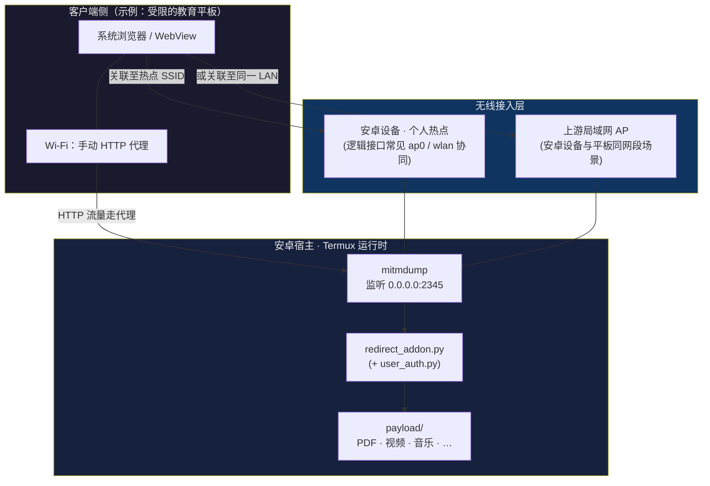
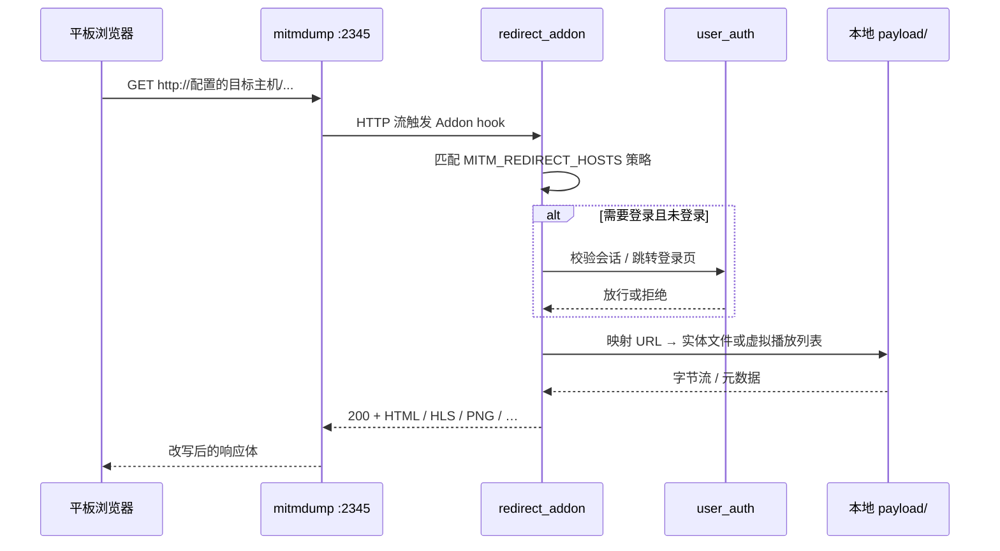
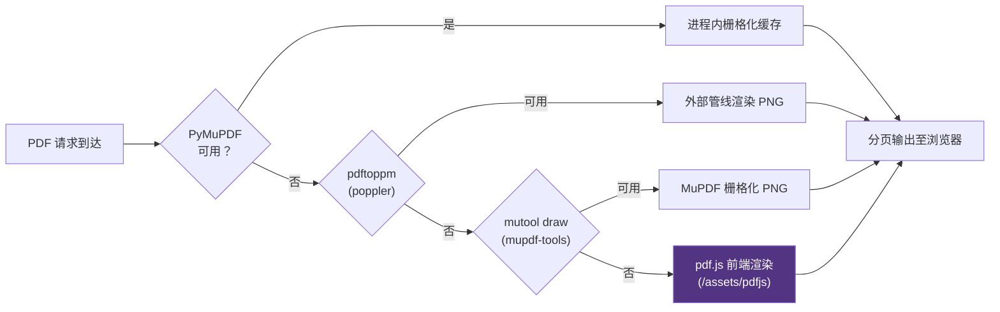
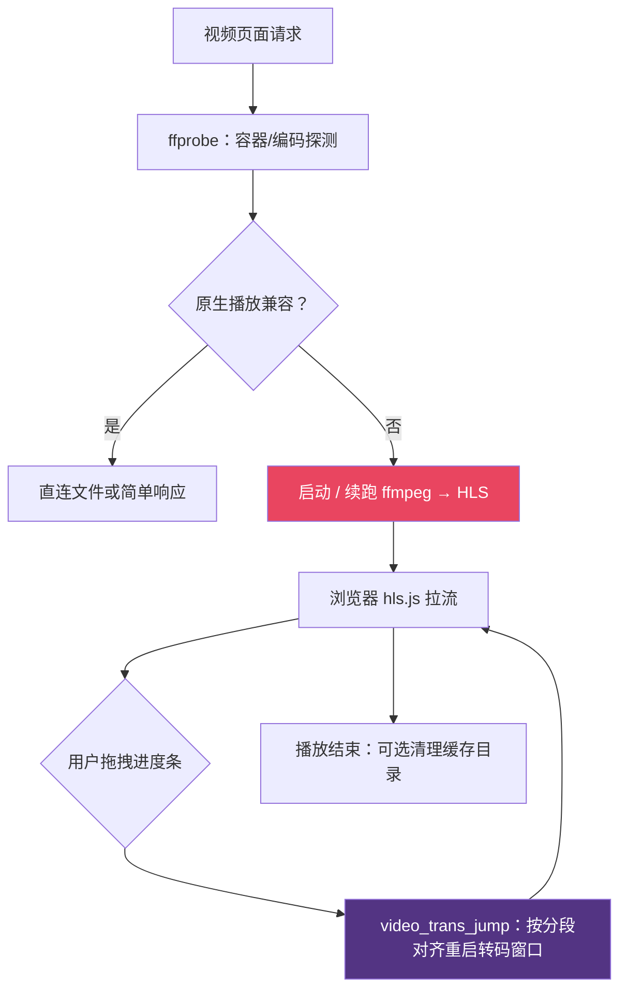
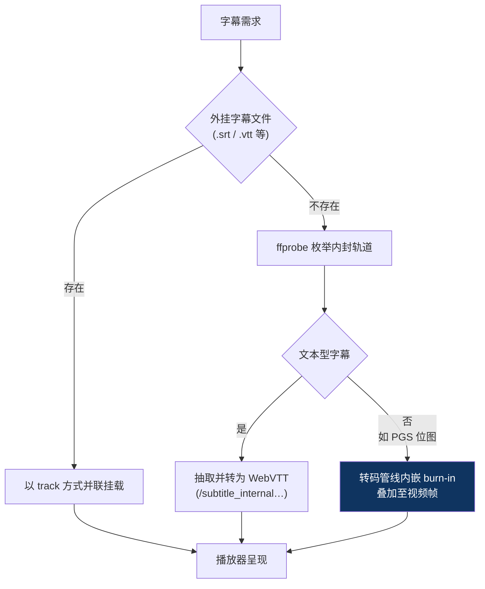
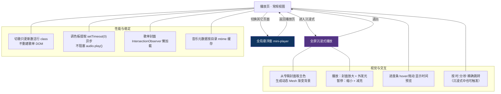

# VerPadProxy（基于 mitmproxy 的个人媒体中枢）

<div align="center">

**在受限网络环境里，把「可配置的 HTTP 入口」升级为可控的本地阅览台**

*面向具备 Wi‑Fi 手动代理能力的终端（例如部分 **受限的教育平板**），由 **安卓宿主设备**（Termux / root 可选）承载 mitmproxy Addon，将指定主机流量改写为本仓库提供的 Web UI。*

</div>

---

## 目录

- [定位](#定位)
- [免责声明与合规边界](#免责声明与合规边界)
- [痛点与适用画像](#痛点与适用画像)
- [系统全景：概念拓扑](#系统全景概念拓扑)
- [请求链路：从浏览器到本地文件](#请求链路从浏览器到本地文件)
- [PDF：多级渲染兜底流水线](#pdf多级渲染兜底流水线)
- [视频：兼容性探测 → HLS 实时转码 → 进度条对齐](#视频兼容性探测--hls-实时转码--进度条对齐)
- [字幕：内封 / 外挂协同策略](#字幕内封--外挂协同策略)
- [音乐：沉浸式播放与后台悬浮窗](#音乐沉浸式播放与后台悬浮窗)
- [安全与会话治理](#安全与会话治理)
- [管理面板：用户探针 / 转码任务](#管理面板用户探针--转码任务)
- [模块与仓库地图](#模块与仓库地图)
- [快速开始 · 桌面侧（Windows）](#快速开始--桌面侧windows)
- [快速开始 · 安卓宿主（Termux）](#快速开始--安卓宿主termux)
- [环境变量参考](#环境变量参考)
- [媒体目录约定](#媒体目录约定)
- [能力矩阵（特性开关）](#能力矩阵特性开关)
- [延伸阅读](#延伸阅读)

---

## 定位

本项目是一套 **HTTP(S) 透明改写层**：在客户端已配置 **HTTP 代理** 的前提下，将被劫持域名下的浏览会话，替换为自建的 **PDF / 音视频 / 图文阅览与上传管理界面**，媒体实体存放在宿主文件系统的 `payload/` 树中，由 `redirect_addon.py` 动态编排响应。

---

## 免责声明与合规边界

- 本项目 **仅供学习研究与个人合规自用**。
- **禁止**用于规避授权控制、渗透测试未授权目标、干扰考试或教务系统、以及任何违反当地法律法规与机构规章的行为。
- 仓库内默认主机名、密码仅为占位演示；**上线前务必替换**为你的环境与强口令。
- 因使用本项目产生的后果由使用者自行承担，贡献者与维护者不承担连带责任。

---

## 痛点与适用画像

| 维度 | 说明 |
|------|------|
| **客户端约束** | 部分 **受限的教育平板** 仅开放浏览器与有限的网络策略，但往往允许配置 **Wi‑Fi 手动 HTTP 代理**。 |
| **宿主侧能力** | **安卓设备** 可通过 Termux 运行 Python 生态与 `mitmdump`；若具备 root，还可辅助热点网关诊断与持久化脚本（可选）。 |
| **体验目标** | 在同一「可被允许的入口」内完成：PDF 分页阅览、视频（含高阶编码）可观可看、音乐与封面、图片与文本、上传下载与权限细分。 |

---

## 系统全景：概念拓扑

下列示意图描述 **两种典型组网**：热点直连（安卓设备作接入点）与局域网共存（平板与安卓设备在同一上游 LAN）。端口以默认 `2345` 为例。



**读图要点**

- 平板 **不需要**安装本项目；它只需 **信任代理路径** 并把 HTTP 会话指向 **安卓设备上 mitmdump 正在监听的地址:端口**。
- HTTPS 若也要进入 Addon 逻辑，需要客户端侧 **导入 mitmproxy CA**（涉及额外信任模型，生产环境请谨慎评估）。

---

## 请求链路：从浏览器到本地文件



---

## PDF：多级渲染兜底流水线

目标是在 **PyMuPDF 不可用或编译失败**（常见于部分 ARM Termux 场景）时，仍能提供可读体验：`poppler` / `mupdf-tools` / 浏览器端 `pdf.js` 形成降级梯队。



---

## 视频：兼容性探测 → HLS 实时转码 → 进度条对齐

对浏览器原生 `<video>` **不友好** 的组合（如 **HEVC Main10 / MKV 封装 / 非常规格式**），服务端侧使用 **ffmpeg** 进行 **实时 HLS（m3u8 + ts）** 输出；前端采用 **hls.js** 播放。  
为实现「整片时长」级别的拖拽体验，Addon 侧维护 **虚拟全长播放列表**、**分段生成状态** 与 **跳转（seek）时重启转码起点** 等协作逻辑（详见 `redirect_addon.py` 中 HLS / transcode 相关路由）。



---

## 字幕：内封 / 外挂协同策略



---

## 音乐：沉浸式播放与后台悬浮窗

播放器分两层 UI：默认为常规播放页，可一键进入 **沉浸式全屏模式**；同时提供 **跨页悬浮窗**，看 PDF / 浏览目录时仍可继续播放。



要点：

- **后台播放不中断**：跨页面切换 / 翻 PDF / 浏览目录均不会重建 audio 元素；悬浮窗位置可拖动并持久化。
- **精确跳转**：沉浸式与常规视图都内置「按 hh : mm : ss 跳转」按钮，配合自定义模态在 WebView 全屏元素中也可正常呼出。
- **元数据健壮**：标题 / 艺术家 / 专辑使用 `mutagen` 解析 ID3 / Vorbis / MP4 标签，多级回退到文件名解析；封面优先级 ID3 内嵌 → 同名 cover.* → 默认 SVG 渐变。

---

## 安全与会话治理

| 维度 | 设计 |
|------|------|
| **单设备登录** | 默认 `MITM_SINGLE_DEVICE=1`：同一账号在新设备登录时旧会话被强制踢下线，杜绝 Cookie 转手 |
| **会话指纹** | 每次登录记录 `ip` / `ua` / `last_seen`，每次请求会刷新 `last_seen`，便于追溯 |
| **URL 混淆** | 通过 `MITM_URL_OBFUSCATE=1` 启用 Fernet 对 `?path=…` 加密（密钥位于 `$MITM_DATA_DIR/.url_secret`），地址栏不再泄露文件树 |
| **特性 ACL** | 文件浏览、PDF、视频、音乐、上传、私密分区互相解耦，不会因为关闭文件浏览而连带屏蔽媒体页 |
| **默认口令** | 首次启动用 `MITM_BOOTSTRAP_PASSWORD` 引导创建 `admin`；生产环境**必须**改为强口令 |

---

## 管理面板：用户探针 / 转码任务

`/__admin` 提供分页式后台（管理员专属）：

- **用户管理**：建号、改密、特性开关、私密目录授权。
- **在线探针 / 用户活动**：实时查看在线用户、最近一次访问的 URL、IP / UA、距今多久；可一键 **踢下线**。
- **转码任务**：列出当前正在跑的 `ffmpeg` HLS 任务，含命中观看者数；可 **强制停止** 或 **清理片段缓存**。同一视频的多个观众共享一个转码进程，最后一个退出后由 reaper 线程在 30 秒后自动收尾。

---

## 模块与仓库地图

| 组件 | 职责 |
|------|------|
| `redirect_addon.py` | mitmproxy Addon：路由聚合、静态资源、`/hls/*`、PDF/视频/音频页面组装 |
| `user_auth.py` | 账户体系、登录握手、特性权限枚举 |
| `assets/pdfjs/` | 离线 pdf.js 运行时（终极兜底） |
| `assets/hlsjs/` | 离线 hls.js（HLS 播放） |
| `termux/*.sh` | 一键环境、`verpadproxy.sh` 运维入口、守护进程脚本等 |
| `payload/` | 媒体内容树（仓库层仅占位 `.gitkeep`，不自携带版权素材） |

---

## 快速开始 · 桌面侧（Windows）

**前置**：Python 3.10+、`mitmproxy`；PDF 体验建议安装 `pymupdf`。

```powershell
pip install mitmproxy pymupdf

mkdir payload\PDF, payload\视频, payload\音乐, payload\private, payload\upl
# 将你的电子书、影片、音频放入对应目录

$env:MITM_REDIRECT_HOSTS = "example.com:8080"
$env:MITM_SHARE_DIR      = "$PWD\payload"
$env:MITM_DATA_DIR       = "$PWD"
mitmdump -s .\redirect_addon.py --listen-host 0.0.0.0 --listen-port 2345
```

在 **受限的教育平板** 上：Wi‑Fi → 手动代理 → **主机填运行 mitmdump 的机器在其网络上的 IPv4** → **端口 2345**。浏览器访问你在 `MITM_REDIRECT_HOSTS` 中配置的 **HTTP** 入口主机名，应落到本仓库登录与首页流程。

---

## 快速开始 · 安卓宿主（Termux）

**前置**：在 **安卓设备** 安装 Termux（推荐 F-Droid 构建）；授予存储访问权限；逐步说明见 [`termux/README_TERMUX.md`](termux/README_TERMUX.md)。

推荐将工程置于共享存储下的 `VerPadProxy/`，首次执行：

```bash
termux-setup-storage
cd ~/storage/shared/VerPadProxy/scripts/termux
bash setup.sh
```

日常启动（示例）：

```bash
bash ~/storage/shared/VerPadProxy/scripts/termux/start.sh
```

若你已验证 **root 路径下启动更稳定**，可参考仓库内 `start_same_as_pc_root.sh` 或 `verpadproxy.sh root-start`（以你设备实测为准）。

**一键查看「热点场景 / 局域网场景」代理应填写的宿主 IPv4：**

```bash
bash /sdcard/VerPadProxy/scripts/termux/verpadproxy.sh info
```

**强烈建议安装的增强依赖（按需）：**

```bash
pkg install -y mupdf-tools poppler ffmpeg
```

---

## 环境变量参考

| 变量 | 含义 |
|------|------|
| `MITM_REDIRECT_HOSTS` | 命中劫持的主机列表（逗号分隔，可含端口）。占位示例：`example.com:8080`。滥用 `*` 将扩大暴露面 |
| `MITM_SHARE_DIR` | 媒体根目录（内含 `PDF/`、`视频/`、`音乐/`、`private/`、`upl/`） |
| `MITM_DATA_DIR` | 用户库、日志等运行期数据目录 |
| `MITM_USERS_FILE` | 用户 JSON 路径（可指向 `$MITM_DATA_DIR` 下） |
| `MITM_BOOTSTRAP_PASSWORD` | **首次**创建 `admin` 时使用的引导口令；生产环境务必显式设定 |
| `MITM_LOG_QUIET` | `1` 时压缩控制台噪声 |
| `MITM_PYMUPDF_PYTHON` | 指定用于 PyMuPDF 子进程的 Python 路径（高级） |
| `MITM_SINGLE_DEVICE` | `1` 启用单设备登录（默认开启）；`0` 允许多端并行 |
| `MITM_URL_OBFUSCATE` | `1` 启用 `?path=` Fernet 加密混淆（默认关闭，密钥落盘 `$MITM_DATA_DIR/.url_secret`） |
| `MITM_MAX_TRANS` | 同时进行的视频转码任务上限；超过排队等待 |

---

## 媒体目录约定

```text
payload/
├── PDF/       # 电子书 PDF
├── 视频/      # 影片；外挂字幕可与视频同目录并按约定文件名匹配
├── 音乐/      # 音频；可选 cover.jpg 作为封面
├── private/   # 私密分区（受权限模型保护）
└── upl/       # 上传落盘目录（受权限模型保护）
```

---

## 能力矩阵（特性开关）

管理员可为账户配置细粒度开关（示例枚举）：`fe_pdf`、`fe_video`、`fe_music`、`fe_upload`、`fe_browse`、`fe_private`、`fe_upl` 等——**首页入口与路径 ACL 解耦**，避免出现「关闭浏览导致 PDF/视频入口一并消失」这类逻辑缠绕（实现细节见 `redirect_addon.py` 与 `user_auth.py`）。

---

## 延伸阅读

- Termux 细化步骤、热点 CA、自启与排障：[`termux/README_TERMUX.md`](termux/README_TERMUX.md)
- 许可证：[LICENSE](LICENSE)

---

## 近期更新

- **音乐播放器**：苹果风沉浸式模式（动态 Mesh 渐变背景、封面交互动效、精确 hh:mm:ss 跳转）；跨页面悬浮窗后台播放（可拖动、半透明毛玻璃、位置持久化）；切歌不再重建歌单 DOM，封面调色板异步提取避免阻塞 `audio.play()`。
- **沉浸式 UI 兼容性**：封面用 `aspect-ratio` + `padding-bottom` 双兜底强制正方形，老内核 WebView 也能渲染；标题 / 副信息 `flex:0 0 auto` + 显式 `min-height` 防止行盒被压缩裁切。
- **PDF**：AJAX 翻页（不重载，不打断音乐）；任意缩放下单指拖动；缩放 / 旋转 / 平移状态持久化；按账号绑定记忆"上次看到第几页"。
- **视频**：HLS 实时转码与 ffmpeg 参数优化（`ultrafast` / `tune=fastdecode` / 540p / `crf 23` / `maxrate 1500k`）；同一视频多观众共享转码进程；任意时刻拖拽对齐；HLS 片段强缓存。
- **字幕**：内封轨道用 `ffprobe` 真实索引匹配；`webvtt` 直读 / `srt → vtt` / `ass → vtt` 多级提取；asscaption 转 VTT 转换器更鲁棒；后台预抽缓存到 `cache/hls/{key}/sub_{idx}.vtt`。
- **安全**：默认启用 **单设备登录**；可选 **`?path=` Fernet 加密混淆**。
- **管理后台**：新增 **用户在线探针** 与 **转码任务管理** 两个页签；可一键踢人 / 中断转码 / 清缓存。
- **Termux**：`verpadproxy.sh` 整合所有运维子命令；`mc up` 改用 `ss -lntp` 探测进程，告别 ADB 下挂起；root 启动通过 `setsid nohup … & disown` 完全脱离 ADB 会话。

---

<div align="center">

**VerPadProxy — 把许可范围内的本地阅读体验，收敛成清晰、可审计的一条 HTTP 代理链路**

</div>
